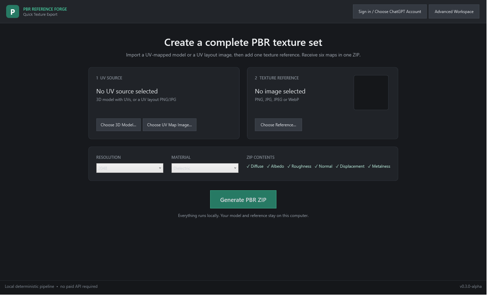

# PBR Reference Forge

PBR Reference Forge is a native Windows desktop application that helps artists turn photographs into a coherent metallic/roughness PBR texture set using either an existing UV-mapped mesh or a UV layout image. It prioritizes artist-usable output and transparent evidence coverage over claims of physically exact reconstruction.

> **Alpha software:** Back up work and validate maps in your target renderer. Reconstructed albedo, roughness, normals, height, metalness and AO are informed estimates, not measured material properties.



## What works in v0.4.1-alpha

- Native dark Windows workspace with 3D orbit/zoom preview and UV inspection
- Default three-step Quick Texture Export: choose a UV model, choose a reference, generate a ZIP
- Alternative image-only workflow: choose a UV layout PNG/JPG instead of a 3D model
- UV image boundary detection, enclosed-island fill, padding and explicit fallback behavior
- **Set Up Codex + GPT** installs the official Codex CLI when needed and uses Codex OAuth through the normal ChatGPT sign-in flow
- Generate invokes real GPT image generation with the UV layout and reference attached; it never silently substitutes the local projector
- Quick ZIP contains exactly Diffuse, Albedo, Roughness, Normal, Displacement and Metalness PNG maps
- The full multi-reference inspection workflow remains available under **Advanced Workspace**
- OBJ, GLB and GLTF import with explicit missing-UV validation
- PNG, JPEG and system-codec WebP reference loading
- Multiple reference assets with Front/Back/Left/Right/Top/Bottom roles, overlay inspection and saved camera-alignment data model
- Multi-reference orthographic projection into UV space with front-facing weighting, manual priority data, blending, and strong/weak/unseen coverage
- Local lighting-flattened albedo reconstruction
- One shared surface representation used to derive albedo, roughness, metalness, tangent-style normal, height, AO and coverage maps
- Material-aware roughness/metalness presets
- UV coverage rasterization, topology-based seam detection and texture dilation primitives
- Non-destructive save/open for `.tforge` project files and autosave recovery file
- Blender/Unreal/Unity-friendly PNG naming and a self-contained Windows build
- Optional, consent-gated, semi-automatic ChatGPT Web Assist with no token/cookie extraction or private APIs

## Install

Download either the standalone `PBR-Reference-Forge-v0.4.1-alpha-win-x64.exe` or the portable ZIP from Releases. Windows 10 22H2 or Windows 11 x64 is recommended. The build is self-contained; no separate .NET install is required. The first GPT setup downloads the complete official Codex Windows runtime and may open a browser for ChatGPT OAuth. Existing incomplete v0.4.0 installations are repaired automatically. If SmartScreen appears for the unsigned alpha, verify the download came from this repository, choose **More info**, then **Run anyway**.

## Workflow

1. Choose either an OBJ/GLB/GLTF model with UVs or a UV layout image.
2. Choose a PNG/JPEG/WebP texture reference.
3. Select resolution and material, then click **Generate PBR ZIP**.
4. Receive Diffuse, Albedo, Roughness, Normal, Displacement and Metalness maps in one ZIP.
5. Use **Advanced Workspace** for multiple views, UV inspection, project files, map soloing and Web Assist.

## Privacy and hardware

Core import, correction, generation and export are fully local and CPU-based. No account or GPU is required. Files leave the computer only when the user explicitly chooses Web Assist and manually uploads them. Logs never include passwords, cookies, tokens or browser storage.

## Supported formats

| Purpose | Formats |
|---|---|
| UV sources | OBJ, GLB, GLTF, or PNG/JPG/JPEG/WebP UV layout image |
| References | PNG, JPG/JPEG, WebP when the Windows codec is installed |
| Export | 8-bit PNG maps |
| Projects | `.tforge` JSON project documents |

## Build and test

Requires the .NET 8 SDK on Windows:

```powershell
dotnet restore TextureCreator.sln
dotnet build TextureCreator.sln -c Release
dotnet test TextureCreator.sln -c Release --no-build
.\scripts\package.ps1
```

The tests cover OBJ import/triangulation, UV extraction, missing UVs, malformed models, coverage rasterization, seam discovery, coherent map generation, image I/O, project round-trip and export. A copyright-free synthetic UV asset is under `samples/SyntheticCube`.

## Architecture

The app uses WPF/.NET 8 with a dependency-light core. Image work uses Windows Imaging Component, geometry preview uses `Viewport3D`, and long generation work runs outside the UI thread. External image generation is isolated behind `IImageGenerationProvider`; the local pipeline has no ChatGPT dependency. See [docs/ARCHITECTURE.md](docs/ARCHITECTURE.md).

## Current limitations and known issues

- This alpha provides role-based orthographic multi-camera reprojection; perspective lens matching and automatic camera solving are not finished.
- Camera alignment controls/data are present, but per-reference gizmo editing is limited to viewport orbit, zoom and overlay opacity.
- Seam topology, coverage, dilation and debug counts are implemented; full cross-island Poisson seam blending and paint tools are not yet exposed in the UI.
- Height is exported as 8-bit PNG; 16-bit/EXR displacement is planned.
- No local ML model downloads, CUDA inference, AO baking from mesh geometry, FBX, UDIM, texture painting, game-engine channel packing, or installer/signing yet.
- GLTF sparse accessors and Draco/meshopt compression are not supported.
- WPF's realtime preview is a practical lit material inspection viewport, not a physically based path tracer.
- Web Assist is deliberately semi-automatic because browser DOM automation is fragile and authentication boundaries must remain intact.

## Troubleshooting

- **Model imports but Generate is unavailable:** unwrap it in a DCC and export UV coordinates.
- **WebP fails:** install Microsoft's WebP Image Extensions or convert to PNG.
- **Large references are slow:** resize source photos near the desired texture resolution.
- **Need logs:** select **Open Logs** in the app toolbar.

## License

MIT. See `LICENSE`.
